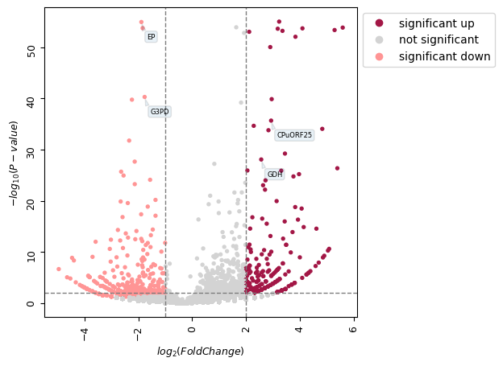

# 🎓 Volcano Plot with Gene Labeling using Python

Welcome to my Fundamentals of Data Science in Precision Medicine and Cloud Computing Data blog, hosted on GitHub!

This repository contains a detailed walkthrough of how I used Python and the `bioinfokit` library to generate a **volcano plot** with **custom gene labels**, as part of my training with the **Stanford Data Ocean Precision Medicine Program**.

---

## 🧠 What’s Inside

📌 **Blog Post**:  
📄 [`volcano_plot_gene_labels.md`](./volcano_plot_gene_labels.md)

📊 **Plot Preview**:  

🧬 **Topics Covered:**
- What is a volcano plot?
- How to interpret log₂ fold change and p-values
- Customizing gene labels in visualizations
- Python code using `bioinfokit`

---

## 🏅 Credential

This blog is based on a project I completed while earning the:

🎓 **Data Analysis Tools** Badge  
🧪 Stanford Data Ocean – Fundamentals of Data Science in Precision Medicine and Cloud Computing  
📅 **Awarded:** July 1, 2025  
👤 **Author:** Kelly Hamisi  
🧠 **#TheMaguyaMatrix**

---

## 🚀 More to Come

I'll be adding more posts on:
- 🧬 Full gene annotation
- 📊 Multi-condition plots
- 🤖 Machine learning in precision medicine

> _“Every plot is a story. Every badge is a milestone.”_

---

## 📫 Let’s Connect

Feel free to reach out, follow, or collaborate!

🔗 [LinkedIn](https://www.linkedin.com/in/kellyhamisi)  
🐦 [X / Twitter](https://x.com/kelly_hamisi)  
📬 Email: *kellyhamisi0@gmail.com*

